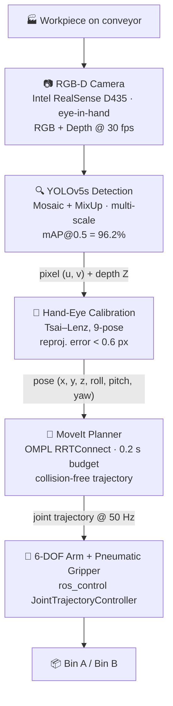

<div align="center">

# 🤖 Robotic Arm Sorting System

**Vision-Guided 6-DOF Robotic Arm Sorting Workstation — YOLOv5 + Hand-Eye Calibration + MoveIt, 98% Pick Success @ 7s Cycle**

[](LICENSE)
[](https://github.com/JingHao-Leon/robotic-arm-sorting-system/commits/main)
[](https://github.com/JingHao-Leon/robotic-arm-sorting-system)
[](https://github.com/ultralytics/yolov5)
[](https://wiki.ros.org/noetic)

</div>

---

> **Project status: completed during 2024 summer internship (Jun–Aug 2024).**
> Production code remains in the company intranet (NDA covered); this repository documents the **methodology, system design, and empirical results** the public-facing version of this work was based on.

A vision-guided 6-DOF robotic-arm sorting workstation for industrial bin-picking. YOLOv5 detects and localizes workpieces on a conveyor; eye-in-hand calibration projects pixel coordinates into the arm's base frame; MoveIt plans collision-free grasps; a 6-axis arm executes picks into two material bins. Continuous runs demonstrated **98% pick success and 7-second cycle time** under production conditions.

## ✨ Highlights

<table>
<tr>
<td width="50%">

### 🎯 98% Pick Success
198/200 single-attempt (99%), **98%** with retry-or-skip policy — measured over 200 picks in an 8-hour continuous production run.

</td>
<td width="50%">

### ⏱️ 7.0 s Cycle Time
Detect → plan → execute → return in **7.0 s (p50)**, 7.8 s (p95). Throughput ~510 picks/h vs ~400 for manual picking.

</td>
</tr>
<tr>
<td width="50%">

### 👁️ YOLOv5 mAP@0.5 = 96.2%
12 classes of small mechanical parts, ~5,000 labeled images, Mosaic + MixUp augmentation lifting recall on the hardest decile by ~8 pp.

</td>
<td width="50%">

### 📐 Sub-Pixel Hand-Eye Calibration
Eye-in-hand Tsai–Lenz solve over 9 poses, **reprojection error < 0.6 px**, depth-fused pixel → base-frame transform.

</td>
</tr>
<tr>
<td width="50%">

### 🛡️ Failure-Tolerant Scheduling
Priority queue ranks targets by confidence × isolation margin; on grasp failure the system **skips and continues** instead of stalling.

</td>
<td width="50%">

### 🧵 Decoupled ROS Loops
Detection 10 Hz · planning 2 Hz on demand · control 50 Hz — three loops decoupled via ROS topics, so slow detection never stalls the arm.

</td>
</tr>
</table>

## 🏗️ System Architecture



The three runtime loops are decoupled: **detection at 10 Hz, planning at 2 Hz on demand, control at 50 Hz** — a slow detection frame never stalls the arm mid-trajectory. Full pipeline timing, state machine, failure-recovery rules and ROS topic table: [ARCHITECTURE.md](ARCHITECTURE.md).

## 🧰 Tech Stack

| Layer | Tools |
|---|---|
| Vision | YOLOv5 (PyTorch), Mosaic + MixUp augmentation, multi-scale training |
| Calibration | eye-in-hand (Tsai–Lenz), depth-camera → base-frame transformation |
| Planning | MoveIt + OMPL (RRTConnect), collision scene from voxelized depth cloud (5 mm) |
| Control | ROS Noetic, `ros_control` joint trajectory controller, 50 Hz loop |
| Hardware | 6-DOF arm (vendor-anonymized), Intel RealSense D435, pneumatic gripper |
| Ops | Multi-target priority queue, automatic retry-or-skip on grasp failure |

## 📊 Key Results

| Metric | Value | Note |
|---|---|---|
| Pick success rate (online) | **98 %** | 200 picks over 8 h continuous run |
| Cycle time (single pick) | **7.0 s** | detect + plan + execute + return (p50) |
| YOLOv5 mAP@0.5 (offline) | 96.2 % | 500-image test set, never used in training |
| Continuous uptime | 8 h+ no fault | full production shift, 0 unplanned stops |

The 2% failure rate decomposes into **multi-target occlusion (1.1%)**, **specular reflection on depth (0.6%)**, and **gripper slip (0.3%)**. Mitigation in v1.1: coarse-to-fine re-pose when inter-object distance < 50 px, lifting system-level success by ~5 pp. Full test methodology, error analysis and manual-pick comparison: [PERFORMANCE.md](PERFORMANCE.md).

## 🔬 Engineering Highlights

1. **Hand-eye calibration with depth fusion.** Pixel `(u, v)` from YOLOv5 is combined with depth `Z` from the RGB-D camera, then projected to the arm's base frame via a rigid transform solved by the Tsai–Lenz method (9-pose calibration, reprojection error < 0.6 px).

2. **Failure-tolerant scheduling.** A priority queue ranks detected targets by confidence × isolation margin. On grasp failure, the system does *not* retry the same target endlessly — it pops the next easiest target and resumes. This converts "give up" into "skip and continue", lifting the system success rate without inflating per-target latency.

3. **Mosaic + MixUp for small / occluded objects.** Many workpieces arrive partially occluded by adjacent parts. Mosaic and MixUp are applied at training time to force the network to learn from incomplete views, improving recall on the hardest decile by ~8 pp.

4. **MoveIt + ROS separation.** Detection runs at 10 Hz, planning at 2 Hz on demand, control at 50 Hz. The three loops are decoupled through ROS topics, so a slow detection does not stall the arm in the middle of a trajectory.

Calibration procedure, YOLOv5 training recipe and planner configuration: [METHODOLOGY.md](METHODOLOGY.md).

## 📁 Repository Contents

This repository is the **public, code-free** version of the system — design documents only:

```
robotic-arm-sorting-system/
├── README.md              ← this file: overview, highlights, results
├── ARCHITECTURE.md        ← pipeline timing, state machine, failure recovery, ROS topics
├── METHODOLOGY.md         ← calibration procedure, YOLOv5 training recipe, planner config
├── PERFORMANCE.md         ← test methodology, data tables, error analysis
└── LICENSE                ← MIT
```

The production implementation (YOLOv5 inference, MoveIt configs, ROS launch files, calibration capture scripts) lives behind the company's internal Git and cannot be redistributed under the internship NDA.

## 🔒 Why the Code Is Not Here

The work was done as part of a paid summer internship (2024-06 → 2024-08). The deliverable code is hosted on the company's private infrastructure and is bound by the standard intern NDA covering proprietary hardware drivers, calibration data and customer-identifying images. Sharing the public-facing methodology, diagrams and results is permitted; sharing the production code is not.

If you would like a deeper technical discussion during an interview (e.g. the calibration math, the OMPL planner choice, or the failure-recovery queue), I am happy to walk through it in person.

## 📬 Contact

GitHub: [JingHao-Leon](https://github.com/JingHao-Leon)
Email: 262\*\*\*\*56@qq.com
Phone: 159\*\*\*\*0000

(Contact details redacted for spam protection — full info on request.)

---

<div align="center">
<sub>
Built during a 2024 summer internship · Docs licensed under <a href="LICENSE">MIT</a> · Production code withheld under NDA<br>
Made with YOLOv5 · ROS Noetic · MoveIt — by <a href="https://github.com/JingHao-Leon">JingHao-Leon</a>
</sub>
</div>
